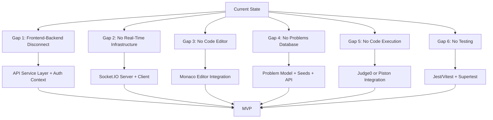

# CodeSync AI — Complete Technical Audit Report

**Date:** 2026-09-01  
**Auditor:** Automated Code Inspection  
**Scope:** Read-only inspection of the entire repository  
**Methodology:** Every source file was read and every claim is traced to actual code evidence.

---

# 1. Executive Summary

CodeSync AI is in an **early development stage**. The project has a functioning authentication system (register/login with bcrypt and JWT) and a backend Room CRUD API with solid validation and authorization middleware. However, the **frontend and backend are largely disconnected** — most frontend pages display hard-coded/static data and make zero API calls to the backend (with the exception of Login and Signup). There is **no real-time collaboration, no code editor, no code execution, no AI integration, no problems database, no testing infrastructure, and no deployment configuration**. The Room page is a placeholder that renders a single `<h1>`. The Profile and Dashboard pages contain entirely static mock data with no backend calls.

**Overall Project Completion: ~15-20% of MVP**

| Area | Status |
|------|--------|
| Authentication (Backend) | ✅ Implemented |
| Authentication (Frontend ↔ Backend) | ⚠️ Partially Integrated |
| Room CRUD (Backend) | ✅ Implemented |
| Room (Frontend) | ❌ Placeholder only |
| Problems System | ❌ Hard-coded frontend only |
| Real-Time Collaboration | ❌ Not Started |
| Code Editor | ❌ Not Started |
| Code Execution | ❌ Not Started |
| AI Features | ❌ Not Started |
| Testing | ❌ Not Started |

---

# 2. Repository Structure

```
CodeSync_ai/
├── .git/
├── codesync_ai_architecture.md          (35 KB planning document)
├── backend/
│   ├── .env                              ⚠️ COMMITTED TO GIT
│   ├── .gitignore
│   ├── package.json
│   ├── package-lock.json
│   ├── server.js                         (entry point)
│   ├── middleware/
│   │   ├── authMiddleware.js
│   │   ├── roomMemberMiddleware.js
│   │   └── validateRoomIdMiddleware.js
│   ├── models/
│   │   ├── User.js
│   │   └── Room.js
│   └── routes/
│       ├── userRoutes.js
│       ├── roomRoutes.js
│       └── testRoutes.js
├── frontend/
│   ├── .gitignore
│   ├── index.html
│   ├── package.json
│   ├── package-lock.json
│   ├── vite.config.js
│   ├── eslint.config.js
│   ├── README.md
│   ├── public/
│   │   ├── favicon.svg
│   │   └── icons.svg
│   └── src/
│       ├── main.jsx
│       ├── App.jsx
│       ├── App.css
│       ├── index.css
│       ├── ProtectedRoute.jsx
│       ├── PublicRoute.jsx
│       ├── assets/
│       │   ├── hero.png
│       │   ├── react.svg
│       │   └── vite.svg
│       ├── components/                   (EMPTY directory)
│       ├── services/                     (EMPTY directory)
│       └── pages/
│           ├── Home.jsx / Home.css
│           ├── Login.jsx / Login.css
│           ├── Signup.jsx / Signup.css
│           ├── Dashboard.jsx / Dashboard.css
│           ├── Profile.jsx / Profile.css
│           ├── Settings.jsx / Settings.css
│           └── Room.jsx                  (no CSS file)
```

> [!WARNING]
> **The `.env` file containing the MongoDB connection string (with credentials) and JWT secret is committed to the repository.** The backend `.gitignore` lists `.env`, but the file is already tracked. This is a **CRITICAL** security issue.

> [!NOTE]
> - The `components/` and `services/` directories exist but are **completely empty** — no reusable components or API service layer has been created.
> - No `controllers/` directory exists — route handlers are defined inline within route files.
> - No root-level `package.json` exists — frontend and backend are independently managed.

---

# 3. Technology Inventory

## Frontend Dependencies ([package.json](file:///c:/Users/Shannu/OneDrive/Documents/CodeSync_ai/frontend/package.json))

| Dependency | Version | Purpose | Usage Status |
|------------|---------|---------|-------------|
| `react` | ^19.2.8 | UI framework | **ACTIVELY USED** |
| `react-dom` | ^19.2.8 | DOM rendering | **ACTIVELY USED** |
| `react-router-dom` | ^7.18.3 | Client-side routing | **ACTIVELY USED** |
| `vite` | ^8.2.2 | Build tool (dev) | **ACTIVELY USED** |
| `@vitejs/plugin-react` | ^6.1.0 | React HMR (dev) | **ACTIVELY USED** |
| `eslint` | ^10.9.0 | Linting (dev) | **INSTALLED, UNCLEAR IF USED** |
| `@types/react` | ^19.2.18 | TypeScript types (dev) | **INSTALLED BUT NOT USED** — no TypeScript in project |
| `@types/react-dom` | ^19.2.4 | TypeScript types (dev) | **INSTALLED BUT NOT USED** — no TypeScript in project |

**Not installed but would be needed:**
- No HTTP client library (uses native `fetch`)
- No state management library (no Context, no Redux, no Zustand)
- No UI component library
- No code editor library (Monaco, CodeMirror)
- No Socket.IO client

## Backend Dependencies ([package.json](file:///c:/Users/Shannu/OneDrive/Documents/CodeSync_ai/backend/package.json))

| Dependency | Version | Purpose | Usage Status |
|------------|---------|---------|-------------|
| `express` | ^5.2.1 | Web framework | **ACTIVELY USED** |
| `mongoose` | ^9.9.4 | MongoDB ODM | **ACTIVELY USED** |
| `mongodb` | ^7.6.0 | MongoDB driver | **INSTALLED BUT REDUNDANT** — Mongoose includes this |
| `bcryptjs` | ^3.0.3 | Password hashing | **ACTIVELY USED** |
| `jsonwebtoken` | ^9.0.3 | JWT auth | **ACTIVELY USED** |
| `cors` | ^2.8.6 | Cross-origin requests | **ACTIVELY USED** (wide-open config) |
| `dotenv` | ^17.4.2 | Environment variables | **ACTIVELY USED** |
| `uuid` | ^14.0.2 | UUID generation/validation | **ACTIVELY USED** |
| `nodemon` | ^3.1.14 | Auto-restart (dev) | **ACTIVELY USED** |

**Not installed but would be needed for planned features:**
- No `socket.io` — real-time collaboration impossible
- No `helmet` — no security headers
- No `express-rate-limit` — no rate limiting
- No `express-validator` or `joi` — no input validation library
- No `nodemailer` — forgot password impossible
- No testing libraries (`jest`, `supertest`, `vitest`)

---

# 4. Frontend Audit

## Page/Component Inventory

| Feature/Page | Files | What It Actually Does | Status | Issues/Missing |
|---|---|---|---|---|
| **App Entry** | [main.jsx](file:///c:/Users/Shannu/OneDrive/Documents/CodeSync_ai/frontend/src/main.jsx) | Renders `<App />` inside `StrictMode` | IMPLEMENTED | — |
| **Routing** | [App.jsx](file:///c:/Users/Shannu/OneDrive/Documents/CodeSync_ai/frontend/src/App.jsx) | Defines 7 routes with `BrowserRouter` | IMPLEMENTED | No 404 catch-all route |
| **Home** | [Home.jsx](file:///c:/Users/Shannu/OneDrive/Documents/CodeSync_ai/frontend/src/pages/Home.jsx) | Static landing page with feature cards | IMPLEMENTED | Entirely static, no API calls |
| **Login** | [Login.jsx](file:///c:/Users/Shannu/OneDrive/Documents/CodeSync_ai/frontend/src/pages/Login.jsx) | Calls POST `/api/users/login`, stores JWT in localStorage, navigates to `/dashboard` | IMPLEMENTED | Hardcoded `localhost:5000` URL |
| **Signup** | [Signup.jsx](file:///c:/Users/Shannu/OneDrive/Documents/CodeSync_ai/frontend/src/pages/Signup.jsx) | Calls POST `/api/users/register`, navigates to `/login` on success | IMPLEMENTED | Hardcoded `localhost:5000` URL; no password strength validation |
| **Dashboard** | [Dashboard.jsx](file:///c:/Users/Shannu/OneDrive/Documents/CodeSync_ai/frontend/src/pages/Dashboard.jsx) | Renders a table of **5 hard-coded problems**, search filter, difficulty filter, room sidebar with non-functional buttons | IN PROGRESS | **Zero API calls**. Problems are a JS array. "Create Room" and "Join Room" buttons have no `onClick` handlers. Active Room and Recently Joined are static empty strings |
| **Profile** | [Profile.jsx](file:///c:/Users/Shannu/OneDrive/Documents/CodeSync_ai/frontend/src/pages/Profile.jsx) | Displays static "User Name", "user@example.com", all stats as 0. Has logout with confirmation modal | IN PROGRESS | **Zero API calls** — does not fetch `/api/users/profile`. All data is hard-coded placeholders |
| **Settings** | [Settings.jsx](file:///c:/Users/Shannu/OneDrive/Documents/CodeSync_ai/frontend/src/pages/Settings.jsx) | Displays "Change Name", "Change Password", and "Preferred Language" sections with non-functional buttons | IN PROGRESS | **Zero API calls**. All buttons are inert (no `onClick`). Language select doesn't save anywhere |
| **Room** | [Room.jsx](file:///c:/Users/Shannu/OneDrive/Documents/CodeSync_ai/frontend/src/pages/Room.jsx) | Reads `roomId` from URL params, logs it, renders `<h1>Room: {roomId}</h1>` | IN PROGRESS | **Placeholder only**. No API call. No editor. No collaboration. No room data fetched |
| **ProtectedRoute** | [ProtectedRoute.jsx](file:///c:/Users/Shannu/OneDrive/Documents/CodeSync_ai/frontend/src/ProtectedRoute.jsx) | Checks if `token` exists in localStorage. Redirects to `/login` if absent | IMPLEMENTED | Only checks **existence**, never validates token with backend |
| **PublicRoute** | [PublicRoute.jsx](file:///c:/Users/Shannu/OneDrive/Documents/CodeSync_ai/frontend/src/PublicRoute.jsx) | Checks if `token` exists in localStorage. Redirects to `/dashboard` if present | IMPLEMENTED | Same issue — expired/invalid tokens pass the check |

## Detailed Frontend Questions with Evidence

**1. How does Login actually work?**  
The [Login.jsx](file:///c:/Users/Shannu/OneDrive/Documents/CodeSync_ai/frontend/src/pages/Login.jsx) component uses native `fetch()` (line 17) to POST email and password to `http://localhost:5000/api/users/login`. On success (`response.ok`), it stores `data.token` in localStorage (line 34) and navigates to `/dashboard` (line 35).

**2. What API endpoint does it call?**  
`POST http://localhost:5000/api/users/login` — hardcoded in [Login.jsx:18](file:///c:/Users/Shannu/OneDrive/Documents/CodeSync_ai/frontend/src/pages/Login.jsx#L18).

**3. Where is the JWT/token stored?**  
`localStorage.setItem("token", data.token)` — [Login.jsx:34](file:///c:/Users/Shannu/OneDrive/Documents/CodeSync_ai/frontend/src/pages/Login.jsx#L34).

**4. Does the frontend attach authentication credentials to protected API requests?**  
**NO.** There is no code anywhere in the frontend that reads the token from localStorage and attaches it as an `Authorization: Bearer <token>` header. A grep for `Authorization` and `Bearer` across the entire frontend returned zero results. The `services/` directory is empty.

**5. How does ProtectedRoute determine whether a user is logged in?**  
By checking `localStorage.getItem("token")` — [ProtectedRoute.jsx:4](file:///c:/Users/Shannu/OneDrive/Documents/CodeSync_ai/frontend/src/ProtectedRoute.jsx#L4). If the value is falsy, redirects to `/login`.

**6. How does PublicRoute determine whether a user is logged in?**  
Same mechanism: `localStorage.getItem("token")` — [PublicRoute.jsx:4](file:///c:/Users/Shannu/OneDrive/Documents/CodeSync_ai/frontend/src/PublicRoute.jsx#L4). If truthy, redirects to `/dashboard`.

**7. Does the frontend verify token validity or only existence?**  
**Only existence.** No validation call is made. An expired or garbage token in localStorage will still grant access to "protected" routes.

**8. Is there an auth context/provider?**  
**NO.** No `createContext`, `useContext`, `AuthContext`, or `AuthProvider` exists anywhere in the frontend. Each component independently reads from localStorage.

**9. Does logout only modify frontend state or call the backend?**  
**Frontend only.** [Profile.jsx:10](file:///c:/Users/Shannu/OneDrive/Documents/CodeSync_ai/frontend/src/pages/Profile.jsx#L10) calls `localStorage.removeItem("token")` and navigates to `/login`. No backend endpoint is called.

**10. Which pages contain static/hard-coded data?**  
- **Dashboard** — 5 hard-coded problems ([Dashboard.jsx:10-41](file:///c:/Users/Shannu/OneDrive/Documents/CodeSync_ai/frontend/src/pages/Dashboard.jsx#L10-L41))
- **Profile** — "User Name", "user@example.com", all stats = 0 ([Profile.jsx:35-37](file:///c:/Users/Shannu/OneDrive/Documents/CodeSync_ai/frontend/src/pages/Profile.jsx#L35-L37))
- **Settings** — All sections are non-functional ([Settings.jsx](file:///c:/Users/Shannu/OneDrive/Documents/CodeSync_ai/frontend/src/pages/Settings.jsx))
- **Home** — Static marketing content ([Home.jsx](file:///c:/Users/Shannu/OneDrive/Documents/CodeSync_ai/frontend/src/pages/Home.jsx))

**11. Which pages fetch real backend data?**  
- **Login** — POST `/api/users/login`
- **Signup** — POST `/api/users/register`
- **No other pages make any API calls.**

**12. Are there broken imports or unused components?**  
- [Profile.jsx:4](file:///c:/Users/Shannu/OneDrive/Documents/CodeSync_ai/frontend/src/pages/Profile.jsx#L4): Commented-out duplicate import `//import { useState } from "react";`
- `App.css` is not imported by `App.jsx` (though `index.css` is imported by `main.jsx`)
- The `components/` directory is empty — no reusable components extracted
- The `services/` directory is empty — no API service layer
- `@types/react` and `@types/react-dom` are installed but the project uses JSX, not TypeScript

**13. Are there obvious runtime risks?**  
- **Expired token → stuck user:** If a token expires, the user can still navigate to protected routes (ProtectedRoute only checks existence). Any subsequent API call would fail with 401 but there's no global error handler.
- **Hardcoded localhost URLs** will break in production.
- **No error boundary** — unhandled errors will crash the app.

---

# 5. Backend Audit

## Architecture Overview

The backend uses **Express 5** on **Node.js** with **Mongoose** connecting to **MongoDB Atlas**. Route handlers are defined **inline within route files** (no separate controllers directory). The server runs on port 5000 with wide-open CORS.

| System | Files | What It Actually Does | Status | Issues |
|---|---|---|---|---|
| **Server Entry** | [server.js](file:///c:/Users/Shannu/OneDrive/Documents/CodeSync_ai/backend/server.js) | Loads env vars, creates Express app, connects to MongoDB, registers routes, listens on port 5000 | IMPLEMENTED | No error middleware, no graceful shutdown, hardcoded port |
| **Database Connection** | [server.js:19-26](file:///c:/Users/Shannu/OneDrive/Documents/CodeSync_ai/backend/server.js#L19-L26) | `mongoose.connect()` with MONGO_URI from `.env` | IMPLEMENTED | Server starts even if DB connection fails (no process.exit) |
| **CORS** | [server.js:14](file:///c:/Users/Shannu/OneDrive/Documents/CodeSync_ai/backend/server.js#L14) | `app.use(cors())` — wide-open, allows all origins | IMPLEMENTED | Not configured for production |
| **JSON Parsing** | [server.js:15](file:///c:/Users/Shannu/OneDrive/Documents/CodeSync_ai/backend/server.js#L15) | `app.use(express.json())` | IMPLEMENTED | No payload size limit specified |
| **User Model** | [User.js](file:///c:/Users/Shannu/OneDrive/Documents/CodeSync_ai/backend/models/User.js) | Schema: name, email (unique), password, activeRoom (default null) | IMPLEMENTED | No timestamps, no indexes beyond email unique |
| **Room Model** | [Room.js](file:///c:/Users/Shannu/OneDrive/Documents/CodeSync_ai/backend/models/Room.js) | Schema: roomId (unique), roomName, createdBy (ref User), users (array ref User), language (default "cpp"), code (default "") | IMPLEMENTED | No timestamps, no max participants field |
| **Auth Middleware** | [authMiddleware.js](file:///c:/Users/Shannu/OneDrive/Documents/CodeSync_ai/backend/middleware/authMiddleware.js) | Extracts JWT from `Authorization` header, verifies with `JWT_SECRET`, sets `req.userId` | IMPLEMENTED | No Bearer prefix validation |
| **Room Member Middleware** | [roomMemberMiddleware.js](file:///c:/Users/Shannu/OneDrive/Documents/CodeSync_ai/backend/middleware/roomMemberMiddleware.js) | Finds room by `roomId` param, checks if `req.userId` is in `room.users`. Attaches `req.room` | IMPLEMENTED | — |
| **Room ID Validation** | [validateRoomIdMiddleware.js](file:///c:/Users/Shannu/OneDrive/Documents/CodeSync_ai/backend/middleware/validateRoomIdMiddleware.js) | Validates `roomId` param is a valid UUID format | IMPLEMENTED | — |
| **User Routes** | [userRoutes.js](file:///c:/Users/Shannu/OneDrive/Documents/CodeSync_ai/backend/routes/userRoutes.js) | register, login, profile (protected) | IMPLEMENTED | No try/catch on register/login routes; console.log of plain password |
| **Room Routes** | [roomRoutes.js](file:///c:/Users/Shannu/OneDrive/Documents/CodeSync_ai/backend/routes/roomRoutes.js) | create, join, get room, update code, leave room — all JWT-protected | IMPLEMENTED | Well-structured with good validation |
| **Test Routes** | [testRoutes.js](file:///c:/Users/Shannu/OneDrive/Documents/CodeSync_ai/backend/routes/testRoutes.js) | POST `/test` — echoes back request body | IMPLEMENTED | Development debugging route, should be removed |
| **Error Handling** | — | No global error middleware | NOT STARTED | Missing `app.use((err, req, res, next) => ...)` |

---

# 6. Authentication Audit

## Registration Flow

```
Frontend (Signup.jsx)
  ↓ POST http://localhost:5000/api/users/register
  ↓ Body: { name, email, password }
Backend (userRoutes.js /register)
  ↓ Validate name, email, password exist
  ↓ Check for existing user by email
  ↓ bcrypt.hash(password, 10) → hashedPassword
  ↓ Create new User document with hashedPassword
  ↓ Save to MongoDB
  ↓ Return { message, user: { name, email } }
Frontend
  ↓ Navigate to /login
```

**Registration is IMPLEMENTED and properly hashes passwords.**

> [!WARNING]
> [userRoutes.js:48-50](file:///c:/Users/Shannu/OneDrive/Documents/CodeSync_ai/backend/routes/userRoutes.js#L48-L50) — The register handler `console.log(password)` prints the **plaintext password** to server logs after hashing and saving. This is a security vulnerability.

> [!WARNING]
> [userRoutes.js:12-53](file:///c:/Users/Shannu/OneDrive/Documents/CodeSync_ai/backend/routes/userRoutes.js#L12-L53) — The register route handler has no try/catch block. If `bcrypt.hash()` or `User.findOne()` or `newUser.save()` throws, Express 5 may handle it, but there's no explicit error handling.

## Login Flow

```
Frontend (Login.jsx)
  ↓ POST http://localhost:5000/api/users/login
  ↓ Body: { email, password }
Backend (userRoutes.js /login)
  ↓ Validate email, password exist
  ↓ User.findOne({ email })
  ↓ bcrypt.compare(password, user.password)
  ↓ jwt.sign({ userId: user._id }, JWT_SECRET, { expiresIn: "7d" })
  ↓ Return { message, token, user: { name, email } }
Frontend
  ↓ localStorage.setItem("token", data.token)
  ↓ Navigate to /dashboard
```

**Login is IMPLEMENTED with proper bcrypt comparison and JWT generation.**

## Authentication Audit Answers

| # | Question | Answer | Evidence |
|---|----------|--------|----------|
| 1 | Is bcrypt actually being used? | **YES** | [userRoutes.js:2](file:///c:/Users/Shannu/OneDrive/Documents/CodeSync_ai/backend/routes/userRoutes.js#L2), [line 29](file:///c:/Users/Shannu/OneDrive/Documents/CodeSync_ai/backend/routes/userRoutes.js#L29), [line 78](file:///c:/Users/Shannu/OneDrive/Documents/CodeSync_ai/backend/routes/userRoutes.js#L78) |
| 2 | Is password hashed before storage? | **YES** | `bcrypt.hash(password, 10)` at [line 29](file:///c:/Users/Shannu/OneDrive/Documents/CodeSync_ai/backend/routes/userRoutes.js#L29) |
| 3 | JWT payload? | `{ userId: user._id }` | [userRoutes.js:91](file:///c:/Users/Shannu/OneDrive/Documents/CodeSync_ai/backend/routes/userRoutes.js#L91) |
| 4 | JWT expiration? | **7 days** (`"7d"`) | [userRoutes.js:93](file:///c:/Users/Shannu/OneDrive/Documents/CodeSync_ai/backend/routes/userRoutes.js#L93) |
| 5 | JWT_SECRET from env? | **YES** | `process.env.JWT_SECRET` at [userRoutes.js:92](file:///c:/Users/Shannu/OneDrive/Documents/CodeSync_ai/backend/routes/userRoutes.js#L92) |
| 6 | What if JWT_SECRET missing? | `jwt.sign()` would throw; no explicit check. Express 5 may catch, but no graceful handling | No fallback code exists |
| 7 | JWT stored in localStorage? | **YES** | [Login.jsx:34](file:///c:/Users/Shannu/OneDrive/Documents/CodeSync_ai/frontend/src/pages/Login.jsx#L34) |
| 8 | HttpOnly cookies used? | **NO** | Zero cookie usage anywhere in codebase |
| 9 | JWT verification middleware? | **YES** | [authMiddleware.js](file:///c:/Users/Shannu/OneDrive/Documents/CodeSync_ai/backend/middleware/authMiddleware.js) — checks header, verifies token, sets `req.userId` |
| 10 | Which routes use JWT middleware? | `GET /api/users/profile`, all room routes (`/api/rooms/*`) | [userRoutes.js:107](file:///c:/Users/Shannu/OneDrive/Documents/CodeSync_ai/backend/routes/userRoutes.js#L107), [roomRoutes.js:15,79,148,173,205](file:///c:/Users/Shannu/OneDrive/Documents/CodeSync_ai/backend/routes/roomRoutes.js#L15) |
| 11 | Token expiration handled? | **Backend: YES** (jwt.verify rejects expired). **Frontend: NO** (only checks existence) | [authMiddleware.js:14-28](file:///c:/Users/Shannu/OneDrive/Documents/CodeSync_ai/backend/middleware/authMiddleware.js#L14-L28) |
| 12 | Invalid token handled? | **Backend: YES** (catch block returns 401). **Frontend: NO** (no 401 interceptor) | [authMiddleware.js:24-28](file:///c:/Users/Shannu/OneDrive/Documents/CodeSync_ai/backend/middleware/authMiddleware.js#L24-L28) |
| 13 | Logout backend invalidation? | **NO** — logout is purely `localStorage.removeItem("token")` | [Profile.jsx:10](file:///c:/Users/Shannu/OneDrive/Documents/CodeSync_ai/frontend/src/pages/Profile.jsx#L10) |
| 14 | Passwords in API responses? | **NO** — register returns `{ name, email }`, login returns `{ name, email }`, profile returns `{ name, email }` | [userRoutes.js:42-45,99-102,121-124](file:///c:/Users/Shannu/OneDrive/Documents/CodeSync_ai/backend/routes/userRoutes.js#L42-L45) |

## Authentication Verdict

> **AUTHENTICATION STATUS: PARTIALLY FUNCTIONAL**

**Reasoning:**
- ✅ Backend auth is properly implemented: bcrypt hashing, JWT generation/verification, protected routes
- ❌ Frontend never sends the JWT token on authenticated requests (no `Authorization` header anywhere)
- ❌ Frontend only checks token existence, not validity
- ❌ No auth context/provider for state management
- ❌ No 401 response handling or auto-logout
- ❌ Plaintext password logged to console on registration
- ❌ JWT secret committed to `.env` which is in git

The backend authentication is solid. The **critical gap** is that the frontend cannot communicate with protected endpoints because it never attaches the JWT to requests.

---

# 7. Profile and Settings Audit

## User Model Fields ([User.js](file:///c:/Users/Shannu/OneDrive/Documents/CodeSync_ai/backend/models/User.js))

| Field | In Database | Backend API Returns | Frontend Displays | Fully Connected |
|-------|-------------|--------------------|--------------------|-----------------|
| **name** | ✅ `required: true` | ✅ `/profile` returns `user.name` | ❌ Hard-coded "User Name" | **NO** |
| **email** | ✅ `required: true, unique: true` | ✅ `/profile` returns `user.email` | ❌ Hard-coded "user@example.com" | **NO** |
| **password** | ✅ `required: true` | ✅ Excluded from responses | N/A | ✅ Correct |
| **activeRoom** | ✅ `default: null` | Not returned by `/profile` | ❌ Not shown | **NO** |
| **Name change** | — | NOT IMPLEMENTED | ❌ Button exists, no handler | NOT IMPLEMENTED |
| **One-time name change** | — | NOT IMPLEMENTED | ❌ Text says "only changed once" but no logic | NOT IMPLEMENTED |
| **Password change** | — | NOT IMPLEMENTED | ❌ Button exists, no handler | NOT IMPLEMENTED |
| **Member since** | ❌ No `createdAt` field / no `timestamps: true` | NOT IMPLEMENTED | Shows "Coming soon" | NOT IMPLEMENTED |
| **Problems solved** | ❌ Not in User model | NOT IMPLEMENTED | Shows "0" (hard-coded) | NOT IMPLEMENTED |
| **Difficulty stats** | ❌ Not in User model | NOT IMPLEMENTED | Shows "0" for Easy/Medium/Hard | NOT IMPLEMENTED |
| **Topic stats** | ❌ Not in User model | NOT IMPLEMENTED | Not displayed | NOT IMPLEMENTED |
| **Room statistics** | ❌ Not in User model | NOT IMPLEMENTED | Shows "0" for Created/Joined | NOT IMPLEMENTED |
| **Recent activity** | ❌ Not in User model | NOT IMPLEMENTED | Shows "No recent activity" | NOT IMPLEMENTED |
| **AI insights** | — | NOT IMPLEMENTED | Not displayed | NOT IMPLEMENTED |

**Critical issue:** The Profile page ([Profile.jsx](file:///c:/Users/Shannu/OneDrive/Documents/CodeSync_ai/frontend/src/pages/Profile.jsx)) does not call `GET /api/users/profile` even though the backend endpoint exists and works. The page displays entirely static placeholder data.

---

# 8. Password Management Audit

## A. Change Password

| Component | Status | Evidence |
|-----------|--------|----------|
| Frontend UI button | EXISTS but inert | [Settings.jsx:54-56](file:///c:/Users/Shannu/OneDrive/Documents/CodeSync_ai/frontend/src/pages/Settings.jsx#L54-L56) — no `onClick` handler |
| Frontend form/modal | **NOT STARTED** | No input fields for current/new/confirm password |
| Backend endpoint | **NOT STARTED** | No `PUT /api/users/password` or similar route exists |
| Current password verification | **NOT STARTED** | — |
| New password hashing | **NOT STARTED** | — |
| Database save | **NOT STARTED** | — |

**Change Password Status: NOT STARTED** (only a non-functional UI button exists)

## B. Forgot Password

| Component | Status | Evidence |
|-----------|--------|----------|
| Frontend link/page | **NOT STARTED** | No "Forgot Password?" link on Login page |
| Email input form | **NOT STARTED** | — |
| Backend endpoint | **NOT STARTED** | — |
| Reset token generation | **NOT STARTED** | — |
| Email sending | **NOT STARTED** | No nodemailer or email library installed |
| Token verification | **NOT STARTED** | — |
| New password save | **NOT STARTED** | — |

**Forgot Password Status: NOT STARTED**

---

# 9. Problems System Audit

## Backend

| Component | Status | Evidence |
|-----------|--------|----------|
| Problem model | **NOT STARTED** | No file in `backend/models/` for problems. Grep for "Problem" returned zero results |
| Problem database collection | **NOT STARTED** | — |
| Seed data | **NOT STARTED** | — |
| Problem API routes | **NOT STARTED** | No problem routes in `server.js` or `routes/` |
| GET all problems | **NOT STARTED** | — |
| GET single problem | **NOT STARTED** | — |
| Search | **NOT STARTED** | — |
| Filtering | **NOT STARTED** | — |

## Frontend

The Dashboard ([Dashboard.jsx:10-41](file:///c:/Users/Shannu/OneDrive/Documents/CodeSync_ai/frontend/src/pages/Dashboard.jsx#L10-L41)) contains **5 hard-coded problems**:

```javascript
const problems = [
  { id: 1, title: "Two Sum", difficulty: "Easy", solved: true },
  { id: 2, title: "Reverse String", difficulty: "Easy", solved: false },
  { id: 3, title: "Valid Parentheses", difficulty: "Easy", solved: true },
  { id: 4, title: "Longest Substring Without Repeating Characters", difficulty: "Medium", solved: false },
  { id: 5, title: "Trapping Rain Water", difficulty: "Hard", solved: false },
];
```

- Search filtering: Works on the hard-coded array (client-side)
- Difficulty filtering: Works on the hard-coded array (client-side)
- Problem clicking: **NO** — the table rows have no `onClick` or `<Link>` navigation
- Problem details page: **NOT STARTED** — no route or component for individual problems
- Tags, examples, constraints, starter code, test cases: **NONE**

**Answer: The current dashboard problems are 100% HARD-CODED FRONTEND DATA (Option A).** There is no backend involvement whatsoever.

---

# 10. User Progress and Activity Audit

| Component | Status | Evidence |
|-----------|--------|----------|
| UserActivity model | **NOT STARTED** | No such model exists |
| Submission model | **NOT STARTED** | No such model exists |
| Embedded user progress | **NOT STARTED** | User model has no progress fields |
| Problems attempted tracking | **NOT STARTED** | — |
| Problems solved tracking | **NOT STARTED** | — |
| Attempts tracking | **NOT STARTED** | — |
| Time spent tracking | **NOT STARTED** | — |
| Language used tracking | **NOT STARTED** | — |
| Solved timestamp | **NOT STARTED** | — |
| Room participation history | **NOT STARTED** | — |

**Verdict: No progress persistence exists.** The `solved: true/false` in the Dashboard is a hard-coded property on the static problem objects, not connected to any user or database.

---

# 11. Rooms System Audit

## Database Layer

| Component | Status | Evidence |
|-----------|--------|----------|
| Room model | **IMPLEMENTED** | [Room.js](file:///c:/Users/Shannu/OneDrive/Documents/CodeSync_ai/backend/models/Room.js) |
| roomId field | **IMPLEMENTED** | UUID string, unique |
| UUID generation | **IMPLEMENTED** | `uuidv4()` in [roomRoutes.js:51](file:///c:/Users/Shannu/OneDrive/Documents/CodeSync_ai/backend/routes/roomRoutes.js#L51) |
| createdBy (host) | **IMPLEMENTED** | ObjectId ref to User |
| users (participants) | **IMPLEMENTED** | Array of ObjectId refs to User |
| language | **IMPLEMENTED** | String, default "cpp" |
| code | **IMPLEMENTED** | String, default "" |
| roomName | **IMPLEMENTED** | String, required, trimmed |
| status field | **NOT STARTED** | No active/ended status |
| timestamps | **NOT STARTED** | No `timestamps: true` in schema |

## Backend API

| Endpoint | Auth | Validation | Status |
|----------|------|-----------|--------|
| `POST /api/rooms/create` | ✅ `protect` | ✅ roomName, language, user exists, user not in active room | **IMPLEMENTED** |
| `POST /api/rooms/join` | ✅ `protect` | ✅ UUID validation, room exists, not already member, user not in active room | **IMPLEMENTED** |
| `GET /api/rooms/:roomId` | ✅ `protect` + `validateRoomId` + `checkRoomMember` | ✅ UUID, membership | **IMPLEMENTED** |
| `PUT /api/rooms/:roomId` | ✅ `protect` + `validateRoomId` + `checkRoomMember` | ✅ code must be string | **IMPLEMENTED** |
| `POST /api/rooms/:roomId/leave` | ✅ `protect` + `validateRoomId` | ✅ User in room, creator transfer/deletion | **IMPLEMENTED** |

## Backend Room Logic Quality

The room backend is the **most well-implemented** part of the project:

- ✅ Prevents creating/joining room if user is already in an active room
- ✅ Prevents duplicate participants
- ✅ Validates UUID format on all parameterized routes
- ✅ Membership check middleware for get/update
- ✅ Host ownership transfer when creator leaves
- ✅ Room deletion when last user leaves
- ✅ Updates `user.activeRoom` on create/join/leave

## Frontend Room Integration

| Component | Status | Evidence |
|-----------|--------|----------|
| Create Room UI | **NOT STARTED** | Button exists ([Dashboard.jsx:266-270](file:///c:/Users/Shannu/OneDrive/Documents/CodeSync_ai/frontend/src/pages/Dashboard.jsx#L266-L270)) but has no `onClick` handler |
| Join Room UI | **NOT STARTED** | Button exists ([Dashboard.jsx:272-277](file:///c:/Users/Shannu/OneDrive/Documents/CodeSync_ai/frontend/src/pages/Dashboard.jsx#L272-L277)) but has no `onClick` handler |
| Room ID input | **NOT STARTED** | No input field for entering room ID |
| Room page content | **PLACEHOLDER** | [Room.jsx](file:///c:/Users/Shannu/OneDrive/Documents/CodeSync_ai/frontend/src/pages/Room.jsx) — renders `<h1>Room: {roomId}</h1>` only |
| Navigate to /room/:roomId | Route exists | [App.jsx:42-48](file:///c:/Users/Shannu/OneDrive/Documents/CodeSync_ai/frontend/src/App.jsx#L42-L48) — but nothing navigates to it |
| Active room display | **NOT STARTED** | Static "You are not currently in a room" |

## Room Specific Answers

1. **Which room endpoints exist?** Create, Join, Get, Update Code, Leave — all 5 exist
2. **Which are protected by JWT?** All 5
3. **Is room ID format validated?** YES, via `validateRoomId` middleware using `uuid.validate()`
4. **Is room existence checked?** YES, in join/get/leave handlers and `checkRoomMember` middleware
5. **Is user allowed to join any room?** YES, any existing room (no invite system)
6. **Are duplicate participants prevented?** YES, [roomRoutes.js:116-124](file:///c:/Users/Shannu/OneDrive/Documents/CodeSync_ai/backend/routes/roomRoutes.js#L116-L124)
7. **Is there a participant limit?** NO
8. **Are host permissions implemented?** Partially — creator transfer on leave, but no host-only actions
9. **Are room states implemented?** NO — no active/ended status field
10. **Does Room page contain collaboration functionality?** **NO** — it's a placeholder `<h1>` tag

## Room System Verdict

> **ROOM SYSTEM: BASIC PROTOTYPE**

The backend CRUD is solid and well-validated. The frontend is a non-functional placeholder. There is zero integration between frontend room UI and backend room API.

---

# 12. Real-Time Collaboration Audit

| Component | Status | Evidence |
|-----------|--------|----------|
| Socket.IO (server) | **NOT STARTED** | Not in `package.json`, not imported anywhere |
| Socket.IO (client) | **NOT STARTED** | Not in `package.json`, not imported anywhere |
| WebSocket server | **NOT STARTED** | — |
| Socket authentication | **NOT STARTED** | — |
| Join room socket event | **NOT STARTED** | — |
| Leave room socket event | **NOT STARTED** | — |
| Code synchronization | **NOT STARTED** | — |
| Presence tracking | **NOT STARTED** | — |
| Reconnection | **NOT STARTED** | — |
| CRDT / OT | **NOT STARTED** | — |

**Verdict: Real-time collaboration is completely NOT STARTED.** Zero WebSocket or Socket.IO code exists anywhere in the project.

---

# 13. Code Editor Audit

| Component | Status | Evidence |
|-----------|--------|----------|
| Monaco Editor | **NOT STARTED** | Not installed, not imported |
| CodeMirror | **NOT STARTED** | Not installed, not imported |
| Any editor library | **NOT STARTED** | Grep for "monaco", "codemirror", "editor" returned zero results |
| Syntax highlighting | **NOT STARTED** | — |
| Starter code | **NOT STARTED** | — |
| Editor persistence | **NOT STARTED** | — |
| Room synchronization | **NOT STARTED** | — |

**Verdict: Code Editor is NOT STARTED.** The Room page is a bare `<h1>` with no editor component.

---

# 14. Code Execution Audit

| Component | Status | Evidence |
|-----------|--------|----------|
| Judge0 | **NOT STARTED** | Not in package.json, no API calls |
| Piston | **NOT STARTED** | — |
| Docker execution | **NOT STARTED** | — |
| Child process execution | **NOT STARTED** | Grep for "child_process" and "exec" returned zero results |
| External execution APIs | **NOT STARTED** | — |
| Run code button | **NOT STARTED** | — |
| Submit code | **NOT STARTED** | — |
| Test case execution | **NOT STARTED** | — |

**Verdict: Code Execution is NOT STARTED.** No code execution mechanism of any kind exists.

> [!NOTE]
> No arbitrary user code is executed on the main backend. This is currently safe only because no execution exists at all.

---

# 15. AI System Audit

| Component | Status | Evidence |
|-----------|--------|----------|
| OpenAI integration | **NOT STARTED** | No import, no API key, no SDK |
| Anthropic integration | **NOT STARTED** | — |
| Gemini integration | **NOT STARTED** | — |
| Any AI API call | **NOT STARTED** | Grep for "openai", "anthropic", "gemini" returned zero results |
| API keys in .env | **NOT STARTED** | Only MONGO_URI and JWT_SECRET present |
| Prompt builders | **NOT STARTED** | — |
| AI recommendations | **NOT STARTED** | — |
| AI hints | **NOT STARTED** | — |

**Verdict: AI System is NOT STARTED.** The "AI" in "CodeSync AI" is aspirational only.

---

# 16. Database Audit

## Models

| Model | File | Purpose | Main Fields | Relationships | Indexes | Status |
|-------|------|---------|-------------|---------------|---------|--------|
| **User** | [User.js](file:///c:/Users/Shannu/OneDrive/Documents/CodeSync_ai/backend/models/User.js) | User accounts | `name` (String, required), `email` (String, required, unique), `password` (String, required), `activeRoom` (String, default null) | Referenced by Room.createdBy & Room.users | `email` (unique — auto-creates index) | IMPLEMENTED |
| **Room** | [Room.js](file:///c:/Users/Shannu/OneDrive/Documents/CodeSync_ai/backend/models/Room.js) | Collaboration rooms | `roomId` (String, required, unique), `roomName` (String, required, trim), `createdBy` (ObjectId ref User), `users` ([ObjectId ref User]), `language` (String, default "cpp"), `code` (String, default "") | createdBy → User, users → [User] | `roomId` (unique — auto-creates index) | IMPLEMENTED |

## Issues Found

| Issue | Severity | Detail |
|-------|----------|--------|
| **No timestamps** | MEDIUM | Neither model uses `{ timestamps: true }`. No `createdAt` or `updatedAt` on any document |
| **No Problem model** | HIGH | Problems are hard-coded in the frontend. No database collection exists |
| **No UserActivity/Submission model** | MEDIUM | No way to track user progress |
| **`activeRoom` uses String** | LOW | Stores UUID string instead of ObjectId ref to Room. Works but is inconsistent with Room.users storing ObjectIds |
| **No index on Room.createdBy** | LOW | Would benefit queries that look up rooms by creator |
| **`mongodb` redundant dependency** | INFORMATIONAL | Both `mongodb` and `mongoose` installed; Mongoose bundles the driver |

---

# 17. Complete API Inventory

| Method | Endpoint | Auth Required | What It Does | Handler Location | Status |
|--------|----------|---------------|--------------|-----------------|--------|
| GET | `/` | NO | Returns "CodeSync AI Backend is running!" | [server.js:30-32](file:///c:/Users/Shannu/OneDrive/Documents/CodeSync_ai/backend/server.js#L30-L32) | IMPLEMENTED |
| POST | `/test` | NO | Echoes request body (debug) | [testRoutes.js:5-12](file:///c:/Users/Shannu/OneDrive/Documents/CodeSync_ai/backend/routes/testRoutes.js#L5-L12) | IMPLEMENTED (debug only) |
| POST | `/api/users/register` | NO | Creates new user with hashed password | [userRoutes.js:12-53](file:///c:/Users/Shannu/OneDrive/Documents/CodeSync_ai/backend/routes/userRoutes.js#L12-L53) | IMPLEMENTED |
| POST | `/api/users/login` | NO | Authenticates user, returns JWT | [userRoutes.js:57-104](file:///c:/Users/Shannu/OneDrive/Documents/CodeSync_ai/backend/routes/userRoutes.js#L57-L104) | IMPLEMENTED |
| GET | `/api/users/profile` | YES (`protect`) | Returns authenticated user's name and email | [userRoutes.js:107-125](file:///c:/Users/Shannu/OneDrive/Documents/CodeSync_ai/backend/routes/userRoutes.js#L107-L125) | IMPLEMENTED |
| POST | `/api/rooms/create` | YES (`protect`) | Creates room with UUID, sets creator | [roomRoutes.js:15-74](file:///c:/Users/Shannu/OneDrive/Documents/CodeSync_ai/backend/routes/roomRoutes.js#L15-L74) | IMPLEMENTED |
| POST | `/api/rooms/join` | YES (`protect`) | Adds user to room's users array | [roomRoutes.js:79-145](file:///c:/Users/Shannu/OneDrive/Documents/CodeSync_ai/backend/routes/roomRoutes.js#L79-L145) | IMPLEMENTED |
| GET | `/api/rooms/:roomId` | YES (`protect` + `validateRoomId` + `checkRoomMember`) | Returns room data | [roomRoutes.js:148-170](file:///c:/Users/Shannu/OneDrive/Documents/CodeSync_ai/backend/routes/roomRoutes.js#L148-L170) | IMPLEMENTED |
| PUT | `/api/rooms/:roomId` | YES (`protect` + `validateRoomId` + `checkRoomMember`) | Updates room code | [roomRoutes.js:173-202](file:///c:/Users/Shannu/OneDrive/Documents/CodeSync_ai/backend/routes/roomRoutes.js#L173-L202) | IMPLEMENTED |
| POST | `/api/rooms/:roomId/leave` | YES (`protect` + `validateRoomId`) | Removes user from room, handles creator transfer/room deletion | [roomRoutes.js:205-279](file:///c:/Users/Shannu/OneDrive/Documents/CodeSync_ai/backend/routes/roomRoutes.js#L205-L279) | IMPLEMENTED |

**Total: 10 endpoints (8 functional, 1 debug, 1 health check)**

---

# 18. Security Findings

| # | Severity | Issue | Location | Detail |
|---|----------|-------|----------|--------|
| 1 | **CRITICAL** | `.env` file committed to Git with MongoDB credentials and JWT secret | [.env](file:///c:/Users/Shannu/OneDrive/Documents/CodeSync_ai/backend/.env) | Contains `MONGO_URI=mongodb+srv://...password...` and `JWT_SECRET=...`. Even though `.gitignore` lists `.env`, the file is already tracked. **Credentials must be rotated immediately.** |
| 2 | **CRITICAL** | Plaintext password logged to console on registration | [userRoutes.js:50](file:///c:/Users/Shannu/OneDrive/Documents/CodeSync_ai/backend/routes/userRoutes.js#L50) | `console.log(password)` prints the raw password |
| 3 | **HIGH** | JWT stored in localStorage | [Login.jsx:34](file:///c:/Users/Shannu/OneDrive/Documents/CodeSync_ai/frontend/src/pages/Login.jsx#L34) | Vulnerable to XSS. HttpOnly cookies would be more secure |
| 4 | **HIGH** | CORS wide-open | [server.js:14](file:///c:/Users/Shannu/OneDrive/Documents/CodeSync_ai/backend/server.js#L14) | `app.use(cors())` allows all origins. Must be restricted in production |
| 5 | **HIGH** | No rate limiting | — | No `express-rate-limit`. Login/register vulnerable to brute force |
| 6 | **HIGH** | No security headers | — | No `helmet` middleware installed or configured |
| 7 | **HIGH** | Frontend never validates JWT | [ProtectedRoute.jsx](file:///c:/Users/Shannu/OneDrive/Documents/CodeSync_ai/frontend/src/ProtectedRoute.jsx) | Checks only `localStorage.getItem("token")` — any non-empty string passes |
| 8 | **MEDIUM** | No input validation library | — | Backend uses manual checks only. No sanitization of user input |
| 9 | **MEDIUM** | No password strength validation | [userRoutes.js:16](file:///c:/Users/Shannu/OneDrive/Documents/CodeSync_ai/backend/routes/userRoutes.js#L16), [Signup.jsx](file:///c:/Users/Shannu/OneDrive/Documents/CodeSync_ai/frontend/src/pages/Signup.jsx) | Any string accepted as password (including "a") |
| 10 | **MEDIUM** | No try/catch on register route | [userRoutes.js:12-53](file:///c:/Users/Shannu/OneDrive/Documents/CodeSync_ai/backend/routes/userRoutes.js#L12-L53) | Database errors would be unhandled (Express 5 may catch, but no graceful response) |
| 11 | **MEDIUM** | No try/catch on login route | [userRoutes.js:57-104](file:///c:/Users/Shannu/OneDrive/Documents/CodeSync_ai/backend/routes/userRoutes.js#L57-L104) | Same issue |
| 12 | **MEDIUM** | No global error handler | [server.js](file:///c:/Users/Shannu/OneDrive/Documents/CodeSync_ai/backend/server.js) | No `app.use((err, req, res, next) => ...)` |
| 13 | **LOW** | Debug `/test` route in production code | [testRoutes.js](file:///c:/Users/Shannu/OneDrive/Documents/CodeSync_ai/backend/routes/testRoutes.js) | Echoes back any request body — information disclosure risk |
| 14 | **LOW** | Port 5000 hardcoded | [server.js:43](file:///c:/Users/Shannu/OneDrive/Documents/CodeSync_ai/backend/server.js#L43) | Should use `process.env.PORT || 5000` |
| 15 | **LOW** | No `express.json()` payload size limit | [server.js:15](file:///c:/Users/Shannu/OneDrive/Documents/CodeSync_ai/backend/server.js#L15) | Potential DoS with large request bodies |
| 16 | **INFORMATIONAL** | HTML `<title>` says "frontend" | [index.html:7](file:///c:/Users/Shannu/OneDrive/Documents/CodeSync_ai/frontend/index.html#L7) | Should be "CodeSync AI" |

---

# 19. Testing Audit

| Test Type | Exists? | What Is Tested | Missing |
|-----------|---------|---------------|---------|
| **Jest** | NO | — | Everything |
| **Vitest** | NO | — | Everything |
| **Supertest** | NO | — | Everything |
| **Cypress** | NO | — | Everything |
| **Playwright** | NO | — | Everything |
| **Any test files** | NO | — | No `*.test.*` or `*.spec.*` files found anywhere |
| **Test scripts in package.json** | NO | Neither package.json has a `test` script | — |

**Verdict: Testing is completely NOT STARTED.** Zero test infrastructure, zero test files, zero test configuration.

---

# 20. Integration Flow Audit

| # | Flow | Status | Where It Breaks |
|---|------|--------|----------------|
| 1 | **Signup → Database → Login** | **WORKING** (NEEDS VERIFICATION) | Signup sends data to backend, backend hashes and saves. User can then login. The flow appears correct from code inspection. Would need runtime verification. |
| 2 | **Login → Authentication → Dashboard** | **PARTIAL** | Login stores token and navigates to Dashboard. But Dashboard never calls any authenticated endpoint, so the "authentication" part is only ProtectedRoute checking token existence. |
| 3 | **Logout → Session termination** | **PARTIAL** | Removes token from localStorage and navigates to login. But token remains valid on the backend for up to 7 days. No server-side invalidation. |
| 4 | **Dashboard → Problems** | **BROKEN** | Dashboard shows hard-coded problems. No problem detail page exists. Clicking a problem does nothing (no onClick/link). |
| 5 | **Problem → Room creation** | **NOT IMPLEMENTED** | No connection between problems and rooms in any code. |
| 6 | **Join Room → Backend validation → Room page** | **NOT IMPLEMENTED** | Join Room button has no onClick handler. Even if navigation to `/room/:roomId` happened, the Room page doesn't call the backend. |
| 7 | **Profile → Real user data** | **BROKEN** | Profile page exists and backend `/api/users/profile` endpoint exists, but Profile.jsx **never calls the endpoint**. It shows "User Name" and "user@example.com" as hard-coded strings. Furthermore, the frontend never sends the `Authorization` header, so even if the call were added, it would fail with 401 until auth headers are implemented. |
| 8 | **Settings → Actual backend updates** | **NOT IMPLEMENTED** | All buttons are inert. No backend endpoints exist for name change, password change, or preference saving. |

---

# 21. Dead Code and Duplication Findings

| # | Type | Location | Detail |
|---|------|----------|--------|
| 1 | **Commented-out duplicate import** | [Profile.jsx:4](file:///c:/Users/Shannu/OneDrive/Documents/CodeSync_ai/frontend/src/pages/Profile.jsx#L4) | `//import { useState } from "react";` — already imported on line 1 |
| 2 | **Commented-out duplicate route** | [server.js:36](file:///c:/Users/Shannu/OneDrive/Documents/CodeSync_ai/backend/server.js#L36) | `//app.use("/api/users", userRoutes);` — duplicate of line 35 |
| 3 | **Debug console.log statements** | [userRoutes.js:48-50](file:///c:/Users/Shannu/OneDrive/Documents/CodeSync_ai/backend/routes/userRoutes.js#L48-L50) | `console.log(name)`, `console.log(email)`, `console.log(password)` — logs registration data including plaintext password |
| 4 | **Debug console.log** | [Room.jsx:6](file:///c:/Users/Shannu/OneDrive/Documents/CodeSync_ai/frontend/src/pages/Room.jsx#L6) | `console.log(roomId)` |
| 5 | **Debug console.log** | [Login.jsx:40](file:///c:/Users/Shannu/OneDrive/Documents/CodeSync_ai/frontend/src/pages/Login.jsx#L40) | `console.log(data)` — logs login response |
| 6 | **Debug console.log** | [Signup.jsx:47](file:///c:/Users/Shannu/OneDrive/Documents/CodeSync_ai/frontend/src/pages/Signup.jsx#L47) | `console.log(data)` — logs signup response |
| 7 | **Unused test route** | [testRoutes.js](file:///c:/Users/Shannu/OneDrive/Documents/CodeSync_ai/backend/routes/testRoutes.js) | POST `/test` — development debugging route still registered in server.js |
| 8 | **Empty directories** | `frontend/src/components/`, `frontend/src/services/` | Created but never populated |
| 9 | **Unused TypeScript types** | [package.json](file:///c:/Users/Shannu/OneDrive/Documents/CodeSync_ai/frontend/package.json) | `@types/react`, `@types/react-dom` installed in a JavaScript project |
| 10 | **Redundant `mongodb` package** | [backend/package.json](file:///c:/Users/Shannu/OneDrive/Documents/CodeSync_ai/backend/package.json) | Both `mongodb` and `mongoose` installed; `mongoose` includes the MongoDB driver |
| 11 | **Commented-out code block** | [roomRoutes.js:149-155](file:///c:/Users/Shannu/OneDrive/Documents/CodeSync_ai/backend/routes/roomRoutes.js#L149-L155) | Old commented-out code in the GET room handler |
| 12 | **App.css conflicts** | [App.css](file:///c:/Users/Shannu/OneDrive/Documents/CodeSync_ai/frontend/src/App.css) vs [index.css](file:///c:/Users/Shannu/OneDrive/Documents/CodeSync_ai/frontend/src/index.css) | Both set body/root styles. App.css is not imported by App.jsx. `index.css` sets `#root { width: 1126px }` which conflicts with `App.css` `#root { min-height: 100vh }`. Since App.css is not imported, it may be dead code |
| 13 | **Unused assets** | `frontend/src/assets/react.svg`, `frontend/src/assets/vite.svg` | Vite boilerplate files not used anywhere |

---

# 22. Current State vs Required State Matrix

| Feature | Current Status | Files Involved | What Actually Works | What Is Missing | Dependencies | Priority | Next Action |
|---------|---------------|----------------|--------------------|-----------------|----|----------|-------------|
| **Registration** | IMPLEMENTED | Signup.jsx, userRoutes.js, User.js | Frontend form → backend → bcrypt hash → DB save | No try/catch on backend, password logged to console, no password strength validation | — | P0 | Add try/catch, remove console.log, add validation |
| **Login** | IMPLEMENTED | Login.jsx, userRoutes.js | Frontend form → backend → bcrypt compare → JWT → localStorage | No try/catch on backend, hardcoded URL | Registration | P0 | Add try/catch, use env for API URL |
| **JWT Authentication** | IMPLEMENTED (backend) | authMiddleware.js, userRoutes.js, roomRoutes.js | Backend middleware verifies JWT on protected routes | Frontend never sends auth header | Login | P0 | Create API service layer with auth headers |
| **Protected Routes** | IN PROGRESS | ProtectedRoute.jsx | Redirects to /login if no token in localStorage | Only checks existence, not validity | JWT Auth | P0 | Add token validation call |
| **Public Routes** | IMPLEMENTED | PublicRoute.jsx | Redirects to /dashboard if token exists | Same existence-only check | JWT Auth | P1 | — |
| **Logout** | IN PROGRESS | Profile.jsx | Removes token, navigates to /login, has confirmation modal | No backend invalidation | — | P1 | Acceptable for MVP |
| **Profile** | IN PROGRESS | Profile.jsx, Profile.css, userRoutes.js (/profile) | UI layout renders, backend endpoint exists | **Frontend never calls backend**. All data hard-coded | Auth headers | P0 | Connect to /api/users/profile |
| **Settings** | IN PROGRESS | Settings.jsx, Settings.css | UI layout renders with sections | All buttons inert. No backend endpoints for any setting | Profile, Auth | P1 | Build backend endpoints, wire frontend |
| **Change Password** | NOT STARTED | — | Nothing | Everything | Auth, Settings | P1 | Full implementation needed |
| **Forgot Password** | NOT STARTED | — | Nothing | Everything (including email service) | — | P2 | Needs email infrastructure |
| **Problems** | IN PROGRESS (frontend only) | Dashboard.jsx | Search/filter on hard-coded data | Problem model, API, database, detail page | — | P0 | Create backend Problem system |
| **Problem Details** | NOT STARTED | — | Nothing | Everything | Problems | P1 | Create page and route |
| **User Activity** | NOT STARTED | — | Nothing | Model, tracking, display | Problems, Rooms | P2 | Create after Problems and Rooms work |
| **Dashboard** | IN PROGRESS | Dashboard.jsx, Dashboard.css | Layout with hard-coded problems and inert room buttons | All data static, buttons non-functional | Problems, Rooms | P0 | Wire to real backend data |
| **Room Creation** | IN PROGRESS | roomRoutes.js, Room.js, Dashboard.jsx | Backend fully implemented | Frontend button has no onClick handler | Auth headers | P0 | Wire frontend to backend |
| **Join Room** | IN PROGRESS | roomRoutes.js, Room.js, Dashboard.jsx | Backend fully implemented | Frontend button has no onClick handler | Auth headers | P0 | Wire frontend to backend |
| **Room Validation** | IMPLEMENTED (backend) | validateRoomIdMiddleware.js, roomMemberMiddleware.js | UUID validation, membership check | Not tested from frontend | Room Creation/Join | P0 | — |
| **Room Authorization** | IMPLEMENTED (backend) | roomMemberMiddleware.js, roomRoutes.js | Only members can access/edit room, creator transfer | No host-only actions | Room Validation | P1 | — |
| **Real-Time Collaboration** | NOT STARTED | — | Nothing | Socket.IO, code sync, presence, CRDT/OT | Room system, Code Editor | P1 | Major feature build |
| **Code Editor** | NOT STARTED | — | Nothing | Monaco/CodeMirror, syntax highlighting, starter code | Room system | P0 | Install and integrate editor library |
| **Code Execution** | NOT STARTED | — | Nothing | Execution engine (Judge0/Piston), test cases | Code Editor, Problems | P1 | Major infrastructure decision |
| **Profile Analytics** | NOT STARTED | — | Nothing | Progress tracking, aggregation queries | User Activity, Problems | P2 | After tracking exists |
| **AI Insights** | NOT STARTED | — | Nothing | AI API, prompts, analytics | Profile Analytics | P3 | Post-MVP |
| **Testing** | NOT STARTED | — | Nothing | Test framework, test files, CI | — | P0 | Set up test infrastructure |
| **Deployment** | NOT STARTED | — | Nothing | Hosting, CI/CD, env management | — | P2 | After MVP features work |

---

# 23. P0/P1/P2/P3 Priority Matrix

## P0 — Critical Before MVP

| # | Item | Reason |
|---|------|--------|
| 1 | **Rotate compromised credentials** | .env with DB password and JWT secret is in git history |
| 2 | **Create API service layer with auth headers** | Frontend cannot talk to any protected endpoint. This blocks everything |
| 3 | **Connect Profile page to backend** | Existing endpoint unused |
| 4 | **Wire Dashboard room buttons to backend** | Backend room API exists but frontend buttons are inert |
| 5 | **Build Room page UI** | Current page is a placeholder `<h1>` |
| 6 | **Add try/catch to register/login handlers** | Unhandled async errors |
| 7 | **Remove `console.log(password)` from register** | Security vulnerability |
| 8 | **Install and integrate code editor** | Core feature |

## P1 — Important MVP Feature

| # | Item | Reason |
|---|------|--------|
| 1 | **Create Problem model and API** | Dashboard problems are hard-coded |
| 2 | **Real-time collaboration (Socket.IO)** | Core differentiator |
| 3 | **Code execution engine** | Users need to run code |
| 4 | **Change Password functionality** | Basic security feature |
| 5 | **Add Helmet and rate limiting** | Production security |
| 6 | **Create auth context/provider** | Centralize auth state |
| 7 | **Add global error handler** | Backend stability |
| 8 | **Configure CORS properly** | Security |

## P2 — Post-MVP

| # | Item | Reason |
|---|------|--------|
| 1 | **Forgot Password (email)** | Requires email infrastructure |
| 2 | **User Activity tracking** | Depends on Problems and Execution |
| 3 | **Profile Analytics** | Depends on User Activity |
| 4 | **Timestamps on all models** | Data hygiene |
| 5 | **Testing infrastructure** | Should start earlier but listed here given current state |
| 6 | **Deployment configuration** | Needs working MVP first |
| 7 | **Problem detail page** | Needs Problem model first |

## P3 — Future/Optional

| # | Item | Reason |
|---|------|--------|
| 1 | **AI insights and recommendations** | Major feature requiring analytics pipeline |
| 2 | **One-time name change restriction** | Nice-to-have |
| 3 | **Preferred language persistence** | Settings enhancement |
| 4 | **Room status (active/ended)** | Room lifecycle management |
| 5 | **Room participant limit** | Scalability concern |

---

# 24. Architectural Gaps

## Gap Analysis: Current State → Clean MVP



### Gap 1: Frontend-Backend Disconnect (P0)
**Current:** Frontend only calls 2 endpoints (register, login). All other pages use hard-coded data. No `Authorization` header is ever sent.  
**Required:** API service module that attaches JWT to all protected requests. Auth context for centralized state. Every page fetches real data.  
**Effort:** Medium

### Gap 2: No Real-Time Infrastructure (P1)
**Current:** Zero WebSocket code.  
**Required:** Socket.IO server, room-based namespaces, code synchronization events, presence tracking.  
**Effort:** Large

### Gap 3: No Code Editor (P0)
**Current:** Room page is a `<h1>` tag.  
**Required:** Monaco Editor (or CodeMirror) with multi-language support, syntax highlighting, theme support.  
**Effort:** Medium

### Gap 4: No Problems Database (P1)
**Current:** 5 hard-coded problems in a JS array with only id/title/difficulty/solved.  
**Required:** Problem Mongoose model with description, examples, constraints, starter code, test cases. Seed script. REST API. Frontend problem detail page.  
**Effort:** Medium

### Gap 5: No Code Execution (P1)
**Current:** Nothing.  
**Required:** Integration with Judge0 or Piston API for sandboxed code execution. Must NOT execute user code on the main backend server.  
**Effort:** Large

### Gap 6: No Testing (P0-P1)
**Current:** Zero tests.  
**Required:** Jest/Vitest for unit tests, Supertest for API tests, basic E2E coverage.  
**Effort:** Ongoing

---

# 25. Recommended Next 3 Steps

---

## Step 1: API Service Layer + Auth Context + Profile Integration

**FEATURE:** Frontend-to-Backend Authentication Bridge

**WHY NOW:** This is the single most critical architectural gap. Until the frontend can send authenticated requests to the backend, no protected feature can work. Every subsequent feature depends on this.

**WHAT ALREADY EXISTS:**
- Backend `protect` middleware works correctly ([authMiddleware.js](file:///c:/Users/Shannu/OneDrive/Documents/CodeSync_ai/backend/middleware/authMiddleware.js))
- Backend `/api/users/profile` endpoint works ([userRoutes.js:107-125](file:///c:/Users/Shannu/OneDrive/Documents/CodeSync_ai/backend/routes/userRoutes.js#L107-L125))
- JWT is stored in localStorage after login ([Login.jsx:34](file:///c:/Users/Shannu/OneDrive/Documents/CodeSync_ai/frontend/src/pages/Login.jsx#L34))
- Empty `services/` directory ready for API module

**WHAT MUST BE ADDED/CHANGED:**

- **Create `frontend/src/services/api.js`** — centralized fetch wrapper that reads token from localStorage and attaches `Authorization: Bearer <token>` header to all requests. Use a configurable base URL (not hardcoded `localhost:5000`).
- **Create `frontend/src/context/AuthContext.jsx`** — React Context providing `{ user, token, login, logout, isAuthenticated, loading }`. Wrap app in provider.
- **Update `Login.jsx`** — use AuthContext `login()` instead of direct localStorage manipulation.
- **Update `Profile.jsx`** — call `GET /api/users/profile` on mount using the API service. Display real `name` and `email`.
- **Update `ProtectedRoute.jsx`** — use AuthContext. Optionally verify token with a backend call on mount.
- **Update `PublicRoute.jsx`** — use AuthContext.
- **Fix backend: Add try/catch to register and login routes, remove `console.log(password)`**

**FILES LIKELY INVOLVED:**
- `frontend/src/services/api.js` (NEW)
- `frontend/src/context/AuthContext.jsx` (NEW)
- `frontend/src/main.jsx` (wrap with AuthProvider)
- `frontend/src/App.jsx`
- `frontend/src/pages/Login.jsx`
- `frontend/src/pages/Profile.jsx`
- `frontend/src/ProtectedRoute.jsx`
- `frontend/src/PublicRoute.jsx`
- `backend/routes/userRoutes.js`

**BACKEND WORK:** Add try/catch to register/login. Remove console.log of password. Consider returning `activeRoom` and `_id` from `/profile`.

**FRONTEND WORK:** Create API service module. Create AuthContext. Refactor Login to use context. Wire Profile to real data.

**DATABASE WORK:** None.

**SECURITY CONSIDERATIONS:** Ensure token is never logged. Handle 401 responses globally (auto-logout). Consider adding token validation endpoint.

**TESTING REQUIREMENTS:** Manually test: login → profile shows real name/email → logout → redirect to login. Test expired token behavior.

**DEFINITION OF DONE:**
- [ ] API service module sends `Authorization: Bearer` header on all protected requests
- [ ] AuthContext provides centralized auth state across the app
- [ ] Profile page displays the logged-in user's actual name and email from the database
- [ ] ProtectedRoute uses AuthContext (not raw localStorage)
- [ ] Expired/invalid token causes redirect to login
- [ ] `console.log(password)` removed from register handler
- [ ] Register and login routes wrapped in try/catch

---

## Step 2: Wire Dashboard Room Buttons to Backend Room API

**FEATURE:** Room Creation and Joining from the Frontend

**WHY NOW:** The backend Room API is the most complete backend feature, with 5 endpoints, UUID validation, membership checks, and creator transfer. But the frontend buttons are completely inert. This step bridges that gap with minimal new backend work.

**WHAT ALREADY EXISTS:**
- Backend: `POST /api/rooms/create`, `POST /api/rooms/join`, `GET /api/rooms/:roomId`, `POST /api/rooms/:roomId/leave` — all working with auth
- Frontend: "Create Room" and "Join Room" buttons on Dashboard
- Frontend: Route for `/room/:roomId` with basic Room component
- Frontend: `useParams()` already reads `roomId` in Room.jsx

**WHAT MUST BE ADDED/CHANGED:**

- **Dashboard "Create Room" button:** Open a modal/form collecting `roomName` and `language`. Call `POST /api/rooms/create`. On success, navigate to `/room/:roomId`.
- **Dashboard "Join Room" button:** Open a modal/form with a Room ID text input. Call `POST /api/rooms/join`. On success, navigate to `/room/:roomId`.
- **Dashboard "Active Room" section:** On mount, check if user has an `activeRoom`. If so, display it with a link to enter.
- **Room.jsx:** Call `GET /api/rooms/:roomId` on mount. Display room name, participants, language. Add a "Leave Room" button calling `POST /api/rooms/:roomId/leave`.
- **Backend `/api/users/profile`:** Return `activeRoom` field so frontend can show active room status.

**FILES LIKELY INVOLVED:**
- `frontend/src/pages/Dashboard.jsx`
- `frontend/src/pages/Room.jsx`
- `frontend/src/services/api.js` (add room API calls)
- `backend/routes/userRoutes.js` (return activeRoom in profile)

**BACKEND WORK:** Minimal — only update profile response to include `activeRoom`.

**FRONTEND WORK:** Create room modal, join room modal, room page content, leave room button.

**DATABASE WORK:** None.

**SECURITY CONSIDERATIONS:** Use API service with auth headers (from Step 1). Handle error responses (room not found, already in room, etc.).

**TESTING REQUIREMENTS:** Create room → get room ID → join room from another account → verify both appear in room → leave room → verify activeRoom cleared.

**DEFINITION OF DONE:**
- [ ] "Create Room" opens a form, collects room name and language, calls API, navigates to room
- [ ] "Join Room" opens a form, collects room ID, calls API, navigates to room
- [ ] Room page shows real room data (name, language, participants)
- [ ] "Leave Room" button works and returns user to dashboard
- [ ] Active Room section on dashboard reflects real state
- [ ] Error states handled (invalid ID, room not found, already in room)

---

## Step 3: Integrate Code Editor into Room Page

**FEATURE:** Monaco Editor in the Collaboration Room

**WHY NOW:** After Steps 1 and 2, users can authenticate, create rooms, and join rooms. The Room page needs actual content. A code editor is the minimum viable room experience and is prerequisite to real-time collaboration and code execution.

**WHAT ALREADY EXISTS:**
- Room page renders at `/room/:roomId`
- Backend stores `code` and `language` on the Room model
- Backend `PUT /api/rooms/:roomId` updates the code field
- Backend returns room data with current code on `GET /api/rooms/:roomId`

**WHAT MUST BE ADDED/CHANGED:**

- **Install `@monaco-editor/react`** in frontend
- **Room.jsx:** Integrate Monaco Editor component. Load initial code from `GET /api/rooms/:roomId` response. Set language from room data.
- **Add auto-save or manual save:** Periodically or on button click, `PUT /api/rooms/:roomId` with the current editor content.
- **Add language selector** in room header matching the allowed languages (`javascript`, `python`, `java`, `cpp`)
- **Room layout:** Split view with room info/participants panel on side and editor taking main space.

**FILES LIKELY INVOLVED:**
- `frontend/package.json` (add `@monaco-editor/react`)
- `frontend/src/pages/Room.jsx` (major rewrite)
- `frontend/src/pages/Room.css` (NEW)
- `frontend/src/services/api.js` (add room code update call)

**BACKEND WORK:** Minimal — endpoints already exist. May want to add a language update endpoint.

**FRONTEND WORK:** Major — install Monaco, build room layout, integrate editor, implement save.

**DATABASE WORK:** None.

**SECURITY CONSIDERATIONS:** Code is saved as a string to the database — ensure it's treated as data, not executed. Consider max code size limits.

**TESTING REQUIREMENTS:** Open room → type code → save → reload → code persists. Two users in same room can each save (note: not real-time yet, just persistence).

**DEFINITION OF DONE:**
- [ ] Monaco Editor renders in the Room page with syntax highlighting
- [ ] Editor loads existing code from the room's database record
- [ ] Editor language matches room's configured language
- [ ] User can type code and save it to the backend
- [ ] Saved code persists across page reloads
- [ ] Room layout has header with room name, language, participants, and Leave button

---

# 26. Final Project Status

```
╔══════════════════════════════════════════════════════════════╗
║                   CODESYNC AI — PROJECT STATUS               ║
╠══════════════════════════════════════════════════════════════╣
║                                                              ║
║  Overall Completion:  ████░░░░░░░░░░░░░░░░  ~15-20% of MVP  ║
║                                                              ║
║  ┌─────────────────────────────┬───────────────────────┐     ║
║  │ Backend Auth                │ ████████████████ Done  │     ║
║  │ Backend Room CRUD           │ ████████████████ Done  │     ║
║  │ Backend Middleware          │ ████████████████ Done  │     ║
║  │ Frontend Auth (Login/Signup)│ ████████████░░░░ 75%   │     ║
║  │ Frontend Pages (UI Shell)   │ ████████░░░░░░░░ 50%   │     ║
║  │ Frontend-Backend Integration│ ████░░░░░░░░░░░░ 15%   │     ║
║  │ Problems System             │ ██░░░░░░░░░░░░░░  5%   │     ║
║  │ Room Frontend               │ █░░░░░░░░░░░░░░░  5%   │     ║
║  │ Real-Time Collaboration     │ ░░░░░░░░░░░░░░░░  0%   │     ║
║  │ Code Editor                 │ ░░░░░░░░░░░░░░░░  0%   │     ║
║  │ Code Execution              │ ░░░░░░░░░░░░░░░░  0%   │     ║
║  │ AI Features                 │ ░░░░░░░░░░░░░░░░  0%   │     ║
║  │ Testing                     │ ░░░░░░░░░░░░░░░░  0%   │     ║
║  │ Deployment                  │ ░░░░░░░░░░░░░░░░  0%   │     ║
║  └─────────────────────────────┴───────────────────────┘     ║
║                                                              ║
║  Strongest Area:  Backend Room API (well-validated, secure)  ║
║  Weakest Area:    Frontend-Backend integration (nearly zero) ║
║  Critical Issue:  .env with credentials committed to git     ║
║  Blocking Issue:  Frontend cannot call protected endpoints   ║
║                                                              ║
║  Recommended Focus: Build the authentication bridge          ║
║  (API service layer + Auth context) before anything else.    ║
║                                                              ║
╚══════════════════════════════════════════════════════════════╝
```

**Bottom Line:** The project has a solid backend authentication and room management foundation. The immediate priority is creating the API service layer so the frontend can actually communicate with the backend's protected endpoints. Without this bridge, no further feature work is meaningful.
