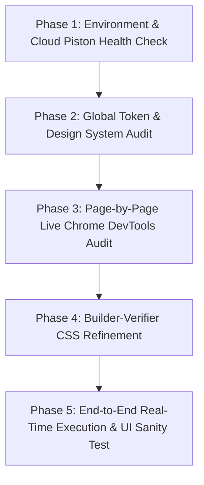

# Autonomous CSS Elevation & Piston Verification Plan

This plan establishes a structured **Builder-Verifier** pipeline to systematically inspect, audit, and upgrade the entire styling suite of **CodeSync AI** using live Chrome DevTools analysis while verifying end-to-end cloud code execution with Piston on Azure.

---

## 1. Architectural Guardrails
- **Zero Functional Breakage**: Preserve all existing CSS class names, IDs, data attributes, and DOM structures.
- **Preserve Pure CSS Foundation**: Enhance the existing design tokens in `frontend/src/index.css` (Obsidian slate `#080b0f`, Safety Orange `#f97316`, Cyan `#06b6d4`) without forcing unwanted frameworks.
- **Linear & Vercel Aesthetic Benchmark**:
  - Crisp spatial cadence (4px / 8px / 12px / 16px / 24px).
  - Subtle low-opacity borders (`border: 1px solid rgba(255, 255, 255, 0.08)`).
  - Glassmorphic navigation & sticky toolbars (`backdrop-filter: blur(12px)`).
  - Micro-interactions: Smooth hover lifts, active button feedback, subtle glow accents, and live collaborator status pulses.
  - Razor-sharp typography hierarchy (IBM Plex Sans for UI, IBM Plex Mono / JetBrains Mono for code & data).

---

## 2. Builder-Verifier Phase Matrix

---

## 3. Detailed Phase Breakdown

### Phase 1: Cloud Piston Execution Verification
- [ ] Verify `backend/.env` points to `PISTON_URL=http://172.198.75.210` (or Nginx proxy over port 80).
- [ ] Run backend test runner across all 4 supported languages:
  - **C++ (GCC)**: Memory safety, standard library vectors, execution time output.
  - **Python 3**: Execution and stdout parsing.
  - **JavaScript (Node.js)**: Async execution & multi-test harness.
  - **Java**: Main class compilation and execution.
- [ ] Ensure backend error handling maps compiler errors, runtime errors, and timeouts gracefully to the UI.

---

### Phase 2: Global Design System & Token Polish (`index.css`)
- [ ] Audit global CSS variables in `frontend/src/index.css`.
- [ ] Refine surface layering:
  - Base Background: `--bg-primary` (`#080b0f`)
  - Elevated Cards: `--bg-surface` (`#0f141c`)
  - Floating Overlays & Modals: `--bg-elevated` (`#161e28`)
- [ ] Add standardized utility classes for:
  - `.cyber-card`: Subtle border + hover glow.
  - `.glass-panel`: Translucent blurred background for headers and floating control bars.
  - `.pulse-online`: Glowing green heartbeat dot for active multiplayer users.
  - `.btn-shimmer`: Polished gradient border transition for primary CTA buttons.
  - `.custom-scrollbar`: Modern thin dark scrollbar for Monaco editor and problem description panes.

---

### Phase 3: Page-by-Page Chrome DevTools Live Audit & Enhancement

| Target Page / Component | CSS File | Key Elevation Focus |
| :--- | :--- | :--- |
| **Landing Page** | `pages/Home.css` | High-impact hero section, code preview terminal window with macOS-style window dots, responsive feature grid, and glowing CTA buttons. |
| **Dashboard** | `pages/Dashboard.css` | Room cards grid with status badges, clean search/filter bar, user stats card, and modal animations. |
| **Problem Workspace** | `pages/ProblemWorkspace.css` | Split-pane editor layout, tabbed navigation (Description, Submissions, Editorial), testcase runner tabs, and output console styling. |
| **Multiplayer Room** | `pages/Room.css` | Synchronized editor layout, live collaborator badge strip, real-time chat drawer, and audio/presence indicators. |
| **Auth Pages** | `pages/Login.css`, `pages/Signup.css` | Centered glass card, high-contrast input fields, floating labels, and Google OAuth button alignment. |
| **Admin Studio** | `pages/AdminDashboard.css`, `pages/AdminProblemEditor.css` | Test case creator tables, JSON schema inputs, markdown problem previewer. |

---

### Phase 4: Live Visual Validation with Chrome DevTools MCP
- [ ] Launch local Vite dev server and attach Chrome DevTools MCP.
- [ ] Inspect each route dynamically:
  - Audit contrast ratios (WCAG AA compliance).
  - Test responsive breakpoints (1920px Desktop, 1366px Laptop, 768px Tablet).
  - Check alignment of all buttons, inputs, icons, and badges.
  - Verify zero horizontal scrollbars or overflowing containers.

---

### Phase 5: Final Acceptance Criteria & Autonomous Sign-Off
- [ ] All pages visually match developer-grade standards (Linear / Vercel style).
- [ ] All existing routes, buttons, forms, and socket connections remain 100% functional.
- [ ] Favicon, tab title, and branding consistently render the updated `CS` logo.
- [ ] Cloud Piston execution passes tests across C++, Python, JavaScript, and Java.
